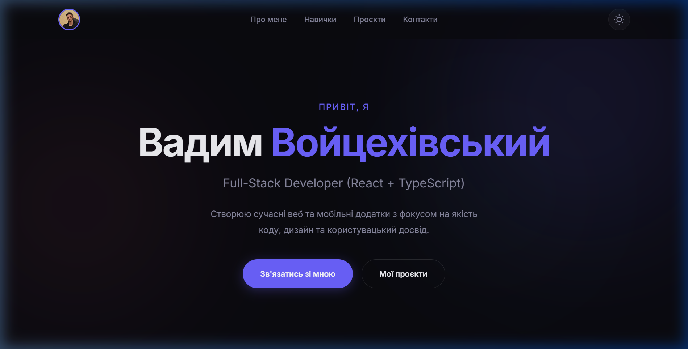
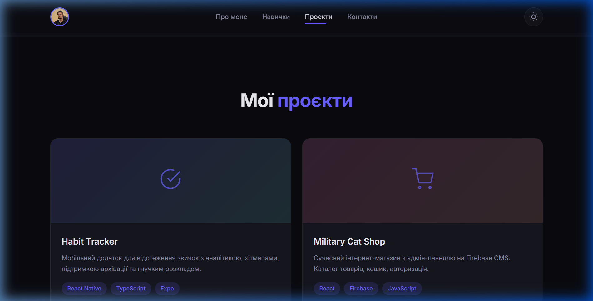

# 🚀 Vadim Voitsehivskyi — Portfolio

Персональний сайт-портфоліо, створений для демонстрації моїх проєктів, навичок та досвіду як Full-Stack розробника.



## ✨ Особливості

- 🌗 **Перемикання теми** — підтримка світлої та темної теми з плавними переходами
- 📱 **Адаптивний дизайн** — коректне відображення на десктопі, планшетах і мобільних пристроях
- 🎬 **Анімації при скролі** — елементи з'являються з анімацією при прокручуванні сторінки
- ⚡ **Чистий стек** — HTML + CSS + JavaScript, без зайвих залежностей
- 🔢 **Лічильник статистики** — анімований підрахунок чисел у секції «Про мене»

## 📸 Скріншоти

### Головна секція (Dark Mode)


### Секція проєктів


## 🛠 Технології

| Технологія | Використання |
|---|---|
| **HTML5** | Семантична структура сторінки |
| **CSS3** | Стилізація, анімації, адаптивність (media queries) |
| **JavaScript** | Інтерактивність, scroll-анімації, перемикач теми |
| **Google Fonts** | Шрифт Inter для типографіки |

## 📂 Структура проєкту

```
portfolio/
├── index.html          # Основний HTML-файл
├── style.css           # Стилі сайту
├── script.js           # Логіка (анімації, тема, меню)
├── photo.jpg           # Фото для навігації
├── MilitaryCat1.png    # Ресурс проєкту
├── screenshots/        # Скріншоти для README
│   ├── hero-dark.png
│   └── projects-dark.png
└── README.md           # Цей файл
```

## 📋 Секції сайту

1. **Hero** — Привітання, ім'я, роль та CTA-кнопки
2. **Про мене** — Коротка біографія та статистика
3. **Навички** — React, TypeScript, HTML/CSS/JS, Firebase, REST API, Git
4. **Проєкти** — Картки з описом, тегами та посиланнями на GitHub:
   - 🟢 Habit Tracker (React Native + TypeScript + Expo)
   - 🛒 Military Cat Shop (React + Firebase)
   - 🌤 Weather Forecast (JavaScript + REST API)
   - 📚 Learning Concepts (React + Wikipedia API)
5. **Контакти** — GitHub, Email, Telegram, LinkedIn

## 🚀 Запуск локально

```bash
# Клонувати репозиторій
git clone https://github.com/vad1m1102/portfolio.git

# Перейти в папку
cd portfolio

# Відкрити index.html у браузері або запустити локальний сервер
python -m http.server 8000
# Потім відкрити http://localhost:8000
```

## 📬 Контакти

- **GitHub:** [vad1m1102](https://github.com/vad1m1102)
- **Email:** vadimvoitsehivskyi1102@gmail.com
- **Telegram:** [@vadim_1102](https://t.me/vadim_1102)
- **LinkedIn:** [Vadim Voitsehivskyi](https://www.linkedin.com/in/%D0%B2%D0%B0%D0%B4%D0%B8%D0%BC-%D0%B2%D0%BE%D0%B9%D1%86%D0%B5%D1%85%D1%96%D0%B2%D1%81%D1%8C%D0%BA%D0%B8%D0%B9-78b318364/)

---

> © 2026 Vadim Voitsehivskyi. Всі права захищені.
